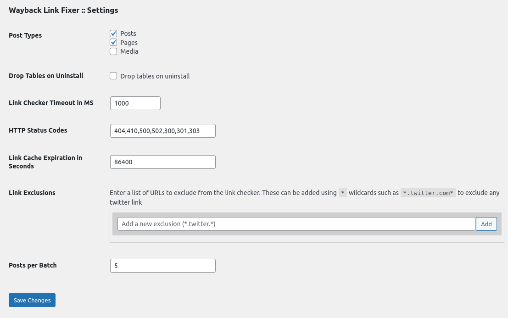
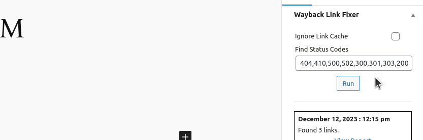
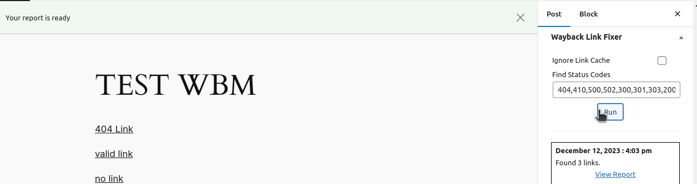
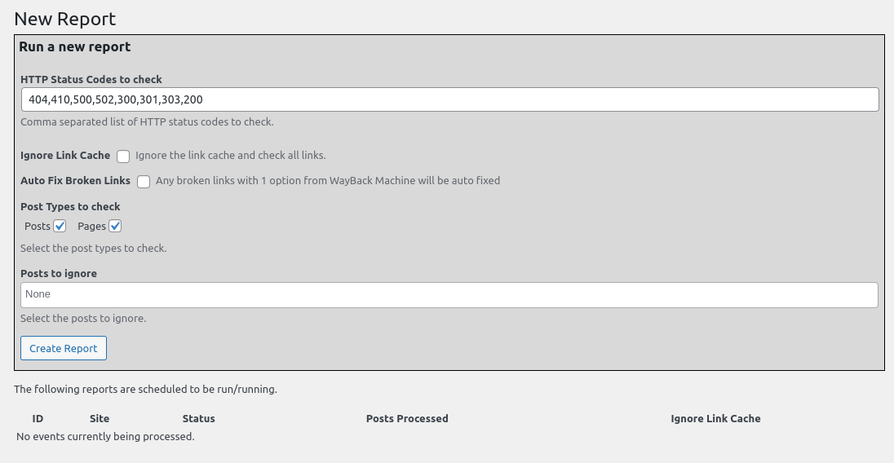
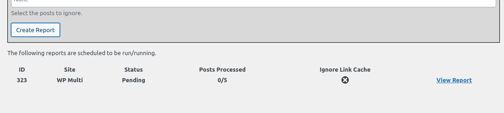
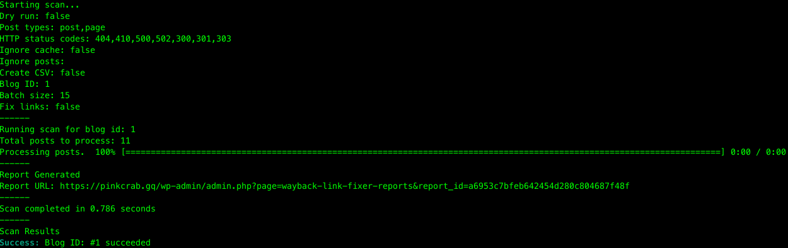
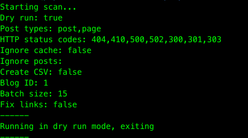

# wayback-link-fixer

**Contributors:** wpcomspecialprojects \
**Tags:** \
**Requires at least:** 6.2 \
**Tested up to:** 6.2 \
**Requires PHP:** 8.0 \
**Stable tag:** 1.0.0   \
**License:** GPLv3 or later \
**License URI:** http://www.gnu.org/licenses/gpl-3.0.html


## Description

A plugin which can be used to both find and fix broken links within post_content fields. This uses the WayBack Machine to look for older versions of the defined post and replace any broken links.

```html
<!-- Old HTML on WayBack Machine -->
<a href="https://www.correct.com/the-link.html">Read more</a>

<!-- Broken Link in Current Post -->
<a href="https://www.broken.com/the-link.html">Read more</a>
```
> Running the fixer on the above example would replace the broken link with the correct one.

### Caveats

IF the WayBack Machine finds multiple links with the same content (`Read More`). It will not fix these, but list them as suggestions on the generated report.

## Installation

To install this plugin, you should donwload the latest version from the [releases page](https://github.com/a8cteam51/wayback-link-fixer/releases) and upload the zip file to your WordPress site.

> This can be added as a git sub module to your project, but this is not recommended as its easier to control the version of the plugin if you download the zip file.

### AFTER ACTIVATION

During Activation the plugin will create 3 tables in the database. These are used to store the data from the WayBack Machine and the results of the fixer. 
> Please note these tables are not prefixed to allow for use on multisites.

### On Uninstall

When the plugin is uninstalled, it will remove the 3 tables from the database. **IF** you have selected the option to drop tables.

## Usage (Single Site)

Once the plugin has been installed, it is worth heading to the setting page and configuring the plugin to your needs.

### Settings

You can find the settings under `Link Fixer` in the admin menu.



#### Post Types
This allows you to select the Post Types that can be checked/fixed. By default this is set to `post` and `page`. Whatever post types are selected here will be the only options you have when running a new report/check. 
> **Please note** the CLI command will allow you to ignore this and check any post type.

#### Drop Tables on Uninstall
Checking this option will see all the tables dropped from the database when the plugin is uninstalled. 
> **Please note** this will remove all data from the tables and cannot be undone.

#### Link Checker Timeout
This allows you to set how long (in Milliseconds) the plugin will wait for a response. This is used for checking if links are valid or following redirection chains. 
> You can increase this value if you are not getting valid results from the link checker.

#### HTTP Status Codes
This allows you to select which HTTP Status codes will be reported on. 
> **Please note** malformed links will be reported, such as (`<a>No href</a>`).

#### Link Cache Expiration
When a link is checked, it is cached to avoid running the same check multiple times. This allows you to set how long (in seconds) the link will be cached for. 
> **Please note** This can ignored on all runners.

#### Link Exclusions
You can add as many links patterns as you wish that should be ignored by the link checker. These can be entered using wildecards (`*`) making it possible to ignore all links from a domain.
> `*.twitter.com*` would ignore all links from any twitter subdomain and with any sub route.

#### Posts per Batch
This allows you to set how many posts will be checked per batch. This used for both the Queue Runner and the CLI Runner.
> **Please note** this is can be overridden by the CLI Runner.

### Run from Single Post
It is possible to run a report for a single post. This can be done from the editor screen for the post. 
> **Please note** this will only run the report and WILL NOT fix any links.



It is possible to choose to ignore the link cache and specify which HTTP Codes to look for (these are pre populated with the settings from the settings page).



Once it has been run, a link to the report will be added below the trigger, with some basic information about the report.

### Run using Action Scheduler

It is possible to run the report using the Action Scheduler. This will allow you to run the report in the background for as many posts and posts types as you wish. 

> **Please note** The plugin includes the Action Scheduler, so you do not need to install WooCommerce or the Action Scheduler directly.

To trigger the creation of a new report, you can addess the `New Report` page under the `Link Fixer` menu.



#### HTTP Status Codes

This allows you to select which HTTP Status codes will be reported on.
> **Please note** malformed links will be reported, such as (`<a>No href</a>`).

#### Ignore Link Cache

This allows you to ignore the link cache and check all links again.

#### Auto Fix Broken Links

This allows you to set that links should be replaced automatically. 
> **Please note** this will only replace links that have been found on the WayBack Machine. See [Auto Fix Links](#auto-fix-links) for more information.


#### Post Types

You can select which post types you would like to check.
> **Please note** this will only show post types that have been selected on the settings page.

#### Posts to Ignore
You can select which posts you would like to ignore. These can be searched via the title and will reflect the chosen post types.

Once the report has been created, it will be added to the queue and will be processed as soon as possible. Once the process has been completed the report will be marked as completed.



> The report will processed in batches of posts, the amount of posts per batch will be controlled by the setting `Posts per Batch`.

All Scheduled Actions are run under the `wpcomsp_wlf` group with the hook `t51_wlf_event_runner`.

### Run Via CLI

You can generate a report using the WP-CLI. This is run synchronously with output in the terminal.

```bash
$ wp wlf_scan
```
When run with no additional arguments, this will run the report based on the settings from the settings page. You can override these settings by using the following arguments.



#### Dry Run

```bash
$ wp wlf_scan --dry-run
```
> This will output the settings based on the settings page and exit.



#### Post Types

```bash
$ wp wlf_scan --post-types=post,page
```
> These can be passed as a comma separated list.
## Auto Fix Links

There are a number of caveats to the auto fixer. These are listed below.

## Frequently Asked Questions

### How can I get help if I'm stuck?

Please reach out to [Glynn](https://github.com/gin0115)

### I have a question that is not listed here

Please leave an [issue](https://github.com/a8cteam51/wayback-link-fixer/issues/new/choose) on the repo and someone will respond as soon as possible and add it this README.


## Screenshots

### 1. Example screenshot

[missing image]

## Changelog

### 1.0.0 (FIRST RELEASE DATE)

* First official release.
