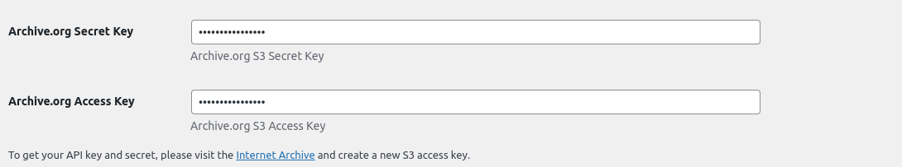
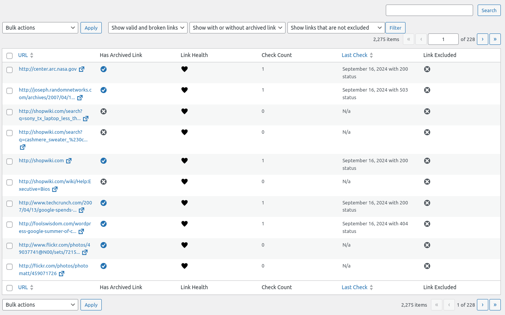

# Team 51 WayBack Link Fixer Plugin

**Contributors:** wpcomspecialprojects \
**Tags:** \
**Requires at least:** 6.4 \
**Tested up to:** 6.5 \
**Requires PHP:** 8.0 \
**Stable tag:** 1.0.0   \
**License:** GPLv3 or later \
**License URI:** http://www.gnu.org/licenses/gpl-3.0.html

## Description

Welcome to **WayBack Link Fixer**, a powerful tool designed to enhance your WordPress site by automatically scanning posts for links, retrieving the latest snapshots from the Wayback Machine, and seamlessly replacing broken links with archived versions. This innovative solution ensures that your posts remain resilient against `BITROT` , preserving the integrity of linked content over time.

## Installation

### Via WP Admin Dashboard

1. Upload the archive using the WordPress plugin uploader.
2. Activate the plugin through the 'Plugins' menu in WordPress.
3. Configure the plugin settings by navigating to the 'WayBack Link Fixer' menu in the WordPress admin dashboard.

### Via FTP

1. Extract the archive and upload the plugin folder to the `/wp-content/plugins/` directory.
2. Activate the plugin through the 'Plugins' menu in WordPress.
3. Configure the plugin settings by navigating to the 'WayBack Link Fixer' menu in the WordPress admin dashboard.

Certainly! Here’s a more polished version for a WordPress plugin readme:

## Configuration

### Post Types


Choose which post types should be checked whenever a post is saved, updated, or when existing posts are scanned.

> By default, `post` and `page` are selected.

### Remove Data on Uninstall


Enable this option to remove all plugin data from the database when the plugin is uninstalled.

> Enabled by default.

### Scan Existing Posts


Enable this option to scan all existing posts for broken links. Only posts that haven't been previously scanned will be checked.

> Enabled by default.

### Link Exclusions


Specify links to exclude from being checked. This is useful for links known to be broken or irrelevant. The `*` wildcard can be used to match any character.

* `https://example.com/*` - Excludes all links starting with `https://example.com/`
* `*.twitter.*` - Excludes all links containing `twitter` in the domain name

### Archive.org API Key



You can use this plugin without an API key, but you will be limited to 200 new snapshots per day. Any new snapshots which need to created after this limit is reached will fail.

> Visit [https://archive.org/account/s3.php](https://archive.org/account/s3.php) to get your API key.

## Links 

Every link which is scanned, is added to the Link Table, this can be accessed under `Links` in the `Tools` menu.



Here you can see the status of each link, the number of snapshots available, and the date of the last snapshot.

### URL

The URL of the link, clicking it will show more details about the link.

### Has Archived Link


 A checkmark indicates that we have a defined archived link for this URL. Clicking this will access the archived snapshot.


 A cross indicates that we do not have an archived link for this URL.

### Link Health


 A heart implies that the link is still pointing to a valid target.


 A broken heart indicates that the link is broken.

### Check Count

Denotes the number of the times we have checked if the link is still active.

### Last Check

Displays the date and time of the last check.

## Actions


You can select which links you wish to apply the bulk actions to by checking the box next to the URL.

### Update Latest Snapshot

This will update the link to the latest snapshot that exists on the Wayback Machine. *This will not create a new snapshot!*

### Create New Snapshot

This will setup an event using the action scheduler to create a new snapshot of the link. If a new snapshot can be created, the links archived link will be updated to the new snapshot.

### Check Link

This will trigger a check of the link to see if it is still active.

## Link Report


Each link has a details page which gives more information about the link.

### Link Details

#### URL 

The URL of the link.

#### Archived URL

The archived URL if one exists.

#### Message 

If there are any issues in creating or finding a snapshot, this will be displayed here.

### Link Checks

This lists all checks, with the date/time plus the resulting http status code. It will also show if the link is broken or not.

### Posts Link Used In

This list all posts which the link appears.

## Post/Page List Table

The number of links and how many are broken is shown on the post list table. 


The link count is clickable, this will access a filtered link list for that post.


## Developer Documentation

### Process (Action Scheduler Events)

Almost all operations are carried out using the Action Scheduler, this allows for the plugin to be more performant and not cause issues with timeouts.

#### Find or Create Snapshot

When a new link is encountered in the content, we check if `Wayback Machine` has a snapshot of the link. If it does we store the snapshot URL. If it does not we attempt to create a new snapshot.

Action : `wlf_find_or_create_snapshot`

Args: [Link ID]

#### Create New Snapshot

If we need to create a new snapshot, we attempt to create one. If we are successful we get a snapshot event id from the "Wayback Machine" and store it.

> We attempt to do this 3 times, with a 15 minute pause between attempts. If we fail we store the error message.

Action: `wlf_create_new_snapshot`

Args: [Link ID, Attempt Number]

> The number of retires can be changed by using the [`wlf_create_new_snapshot_attempts`](#wlf_create_new_snapshot_attempts) filter.

#### Check Snapshot Status

Once we have a snapshot event id, we check the status of the snapshot. If it is successful we update the link with the new snapshot URL.

Action: `wlf_check_snapshot_status`

Args [Link ID, Wayback Event ID, Attempt Number]

> The number of retires can be changed by using the [`wlf_check_snapshot_status_attempts`](#wlf_check_snapshot_status_attempts) filter.

> The time between retries can be changed by using the [`wlf_check_snapshot_status_interval`](#wlf_check_snapshot_status_interval) filter. (Time in seconds)

#### Update Archive URL

Once a snapshot has been created, we attempt to update the link with the new snapshot URL. As it can sometimes take some time for the archives to appear this is checked with a delay between attempts.

Hook: `wlf_update_archive_url`

Args: [Link ID, Attempt Number]

> The number of retires can be changed by using the [`wlf_update_archive_url_attempts`](#wlf_update_archive_url_attempts) filter (3 by default)


#### Scan Existing Posts

When the plugin is activated, we check all existing posts for links. This is done using the `wlf_scan_existing_posts` action. Every 10 minutes we check if there are any posts which has not been scanned. If we find any, 10 will processed at 1 time.

> You can control how many posts are processed per batch using the [`wlf_posts_per_batch`](#wlf_posts_per_batch) filter (defaults to 10)

> You can control how often the scan is run using the [`wlf_scan_existing_posts_interval`](#wlf_scan_existing_posts_interval) filter (defaults to 10 minutes)

### Hooks

The plugin is designed to be extensible, with a number of hooks and filters available for developers to use.

#### `wlf_link_checker_timeout`

This is used to determine how long we should wait when checking if a link is still valid. The default is 5000ms (5 seconds).

```php
add_filter( 'wlf_link_checker_timeout', function( int $timeout ): int {
   return 10000; // 10 seconds
});
```

#### `wlf_link_exclusions`

This is used to add additional exclusions to the link checker. This is fired with the defined exclusions from settings.

```php
add_filter( 'wlf_link_exclusions', function( array $exclusions ): array {
   $exclusions[] = 'https://example.com/*';
   return $exclusions;
});
```

#### `wlf_posts_per_batch`

This is used to define how many posts should be checked, when the plugin is scanning existing posts.

```php
add_filter( 'wlf_posts_per_batch', function( int $posts_per_batch ): int {
   return 20;
});
```

##### `wlf_link_check_duration_in_days`

This is used to define how many days should be between checking if a link is still valid. The default is 7 days.

```php
add_filter( 'wlf_link_check_duration_in_days', function( int $days ): int {
   return 14; // 14 days
});
```

#### `wlf_valid_http_status_codes`

This return array is used to determine what http status codes are considered valid. The default is `200` and `206`.

```php
add_filter( 'wlf_valid_http_status_codes', function( array $codes ): array {
   $codes[] = 301;
   return $codes;
});
```

#### `wlf_failed_checks`

This is used to define how many checks with non valid status codes are encountered before marking a link as broken. The default is 5.

```php
add_filter( 'wlf_failed_checks', function( int $checks ): int {
   return 3;
});
```

#### `wlf_create_new_snapshot_attempts`

This is used to define how many times we should attempt to create a new snapshot. The default is 3.

```php
add_filter( 'wlf_create_new_snapshot_attempts', function( int $attempts ): int {
   return 5;
});
```
#### `wlf_check_snapshot_status_attempts`

This is used to define how many times we should attempt to check the status of a snapshot. The default is 3.

```php
add_filter( 'wlf_check_snapshot_status_attempts', function( int $attempts ): int {
   return 5;
});
```

#### `wlf_check_snapshot_status_interval`

This is used to define how long we should wait between checking the status of a snapshot. The default is 300 seconds (5 minutes).

```php
add_filter( 'wlf_check_snapshot_status_interval', function( int $interval ): int {
   return 10 * \MINUTE_IN_SECONDS; // 10 minutes
});
```

#### `wlf_update_archive_url_attempts`

This is used to define how many times we should attempt to update the archive URL. The default is 3.

```php
add_filter( 'wlf_update_archive_url_attempts', function( int $attempts ): int {
   return 5;
});
```

#### `wlf_scan_existing_posts_interval`

This is used to define how often we should check for posts which have not been scanned. The default is 10 minutes.

```php
add_filter( 'wlf_scan_existing_posts_interval', function( int $interval ): int {
   return 5 * \MINUTE_IN_SECONDS; // 5 minutes
});
```

#### `wlf_is_valid_check`

This filter is used when a url is checked and we are returning if the link is valid or not. The default is to check if the status code is in the `wlf_valid_http_status_codes` array.

```php
add_filter( 'wlf_is_valid_check', function( bool $is_valid, array $check, Link $link ): bool {
   // If the link is from foo.com and the status code is 301 or 302, treate as valid
   if ( strpos( $link->get_href, 'foo.com' ) !== false && in_array( $check['status_code'], [ 301, 302 ] ) ) {
	  return true;
   }
});
```

> The `$check` array contains the following keys: `status_code (string)`, `date (Y-m-d H:i:s)`.
> For all public methods of the `Link` model, see the codebase (src/Link/Link.php)

### Internet Archive / Wayback Link Fixer Instances.

Both the Link Checker and Snapshot clients are all extended from the following interfaces:  

* WPCOMSpecialProjects\Wayback_Link_Fixer\Wayback_Machine\Link_Checker_Client  
* WPCOMSpecialProjects\Wayback_Link_Fixer\Wayback_Machine\Snapshot_Client  

Both of these classes return documented arrays of data, so can be overridden to use a different service if needed.

To change which class is used, you can use the following filters:

#### Link Checker Client.

```php
class My_Custom_Link_Checker_Client implements Link_Checker_Client {
   ....
}

add_filter( 'wlf_link_checker_client', function( Link_Checker_Client $client ): Link_Checker_Client {
   return new My_Custom_Link_Checker_Client();
});
```

#### Snapshot Client.

```php
class My_Custom_Snapshot_Client implements Snapshot_Client {
   ....
}

add_filter( 'wlf_snapshot_client', function( Snapshot_Client $client ): Snapshot_Client {
   return new My_Custom_Snapshot_Client();
});
```
