# Team 51 Wayback Link Fixer Plugin

**Contributors:** wpcomspecialprojects \
**Tags:** \
**Requires at least:** 6.4 \
**Tested up to:** 6.5 \
**Requires PHP:** 7.4 \
**Stable tag:** 1.2.0   \
**License:** GPLv3 or later \
**License URI:** http://www.gnu.org/licenses/gpl-3.0.html

[](https://github.com/a8cteam51/wayback-link-fixer/actions/workflows/unit-tests.yml)


## Description

Welcome to **Internet Archive Wayback Machine Link Fixer**, a WordPress plugin that helps protect your site from **LINKROT**—the slow death of links as web pages change or disappear over time. This plugin automatically scans your post content, both when saving and across existing posts, to find outbound links. For each one, it checks the Wayback Machine for an archived version and creates a new snapshot if none exists.

As original content on the web vanishes, the plugin steps in to keep your links alive by redirecting users to reliable archived versions. It also proactively archives your own posts whenever they’re updated, ensuring your content has a consistent and preserved history.

Maintain link integrity, preserve your content, and let the plugin handle it—automatically.

## Installation

**[Download the latest release](https://github.com/a8cteam51/wayback-link-fixer/releases/latest/download/wayback-link-fixer.zip)**


### Via WP Admin Dashboard

1. Upload the archive using the WordPress plugin uploader.
2. Activate the plugin through the 'Plugins' menu in WordPress.
3. Configure the plugin settings by navigating to the 'Wayback Link Fixer' menu in the WordPress admin dashboard.

### Via FTP

1. Extract the archive and upload the plugin folder to the `/wp-content/plugins/` directory.
2. Activate the plugin through the 'Plugins' menu in WordPress.
3. Configure the plugin settings by navigating to the 'Wayback Link Fixer' menu in the WordPress admin dashboard.

## Configuration

When the plugin is first installed it will give the option to launch the setup wizard, this will guide you through the initial setup of the plugin. Once this has been done, you will be access the settings again to make any changes.

## Settings

### General Plugin Settings

#### Wipe Data on Uninstall

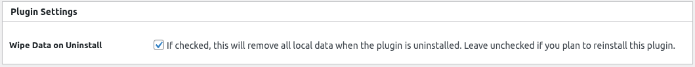

Enable this option to remove all plugin data from the database when the plugin is uninstalled.

> Enabled by default.

### Archive.org API
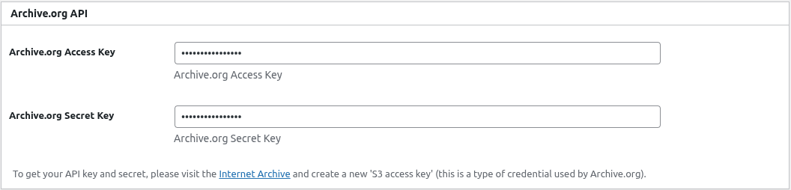

To increase your daily link processing limit, you can enter your free **Archive.org API credentials** in the plugin settings. Just visit [archive.org/account/s3.php](https://archive.org/account/s3.php) to generate your `Access Key` and `Secret Key`.

### Link Fixer Settings

#### Enable Link Fixer
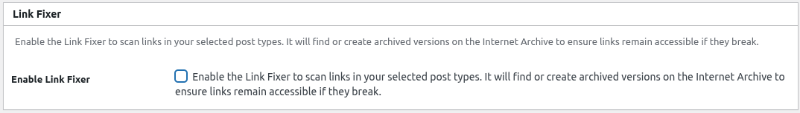

Enable this option to activate the Link Fixer. Once enabled, additional settings will appear to let you customize how links are scanned, archived, and redirected.

#### Post Types

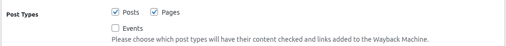

Choose which post types should be checked whenever a post is saved, updated, or when existing posts are scanned.

> By default, `post` and `page` are selected.

#### Scan Existing Posts

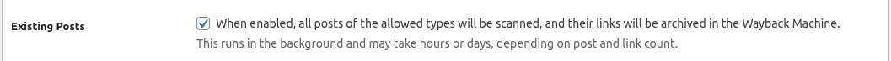

Enable this option to scan all existing posts for broken links. Only posts that haven't been previously scanned will be checked.

> Disabled by default.

#### Link Exclusions

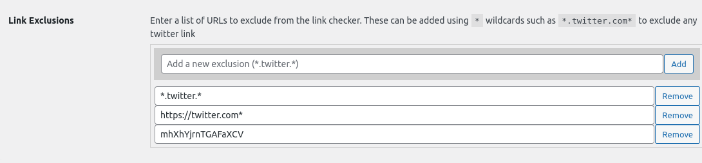

Specify links to exclude from being checked. This is useful for links known to be broken or irrelevant. The `*` wildcard can be used to match any character.

* `https://example.com/*` - Excludes all links starting with `https://example.com/`
* `https://x.com*` - Excludes all links containing `x/twitter` in the domain name

#### Fixer Option

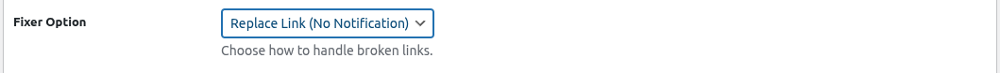

You can choose what outcome you want to happen when a link is found to be broken. The options are:
 * **Do Nothing** - This will not change the link at all, but useful for monitoring content.
 * **Replace Link (No Notification)** - This will replace the broken link with the archived version, if one exists. If no archived version exists, the link will not be changed. No notice will be given to the user that the link has been replaced.


[comment]: # (This actually is the most platform independent comment)

### Auto Archiver

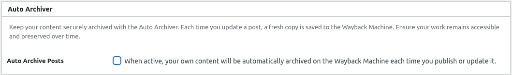

The Auto Archiver automatically creates Wayback Machine snapshots of your own content whenever it’s created or updated (based on allowed post types). You can also enable scheduled archiving to routinely update snapshots over time.

#### Routinely Auto Archive

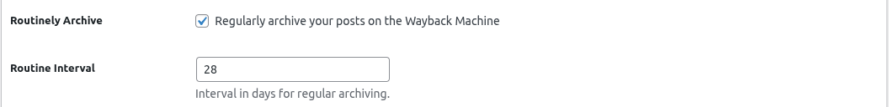

Enable this option to routinely update your posts in the Wayback Machine. This ensures all posts remain archived and up to date. You can also set how many days to wait between each snapshot.

#### Allowed Post Types

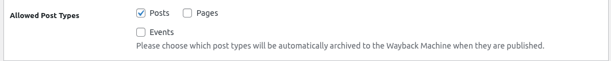

Select which post types should be automatically archived when they are created or updated. Only the selected types will trigger the Auto Archiver on save.


## Dashboard Widget

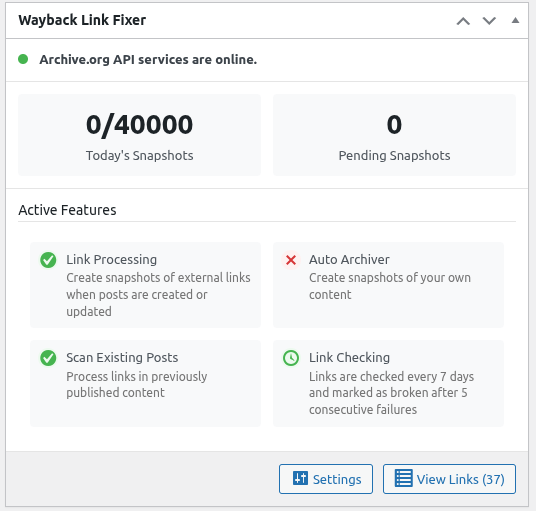

The Dashboard Widget gives you a quick overview of the plugin’s current activity and settings. If you've connected your Archive.org account, it will display how many snapshots have been created today, how many are still pending (waiting to be processed by the Internet Archive), and the current status of various features.

You’ll see whether Link Processing and Auto Archiving are active, whether the plugin is scanning existing posts for broken links, the interval (in days) between routine link checks, and how many consecutive failures are required before a link is considered broken. This widget provides a convenient way to monitor the health and performance of your link preservation setup at a glance.


## Link Fixer

Every link which is scanned, is added to the Link Table, this can be accessed under `Link Fixer` in the `Tools` menu.

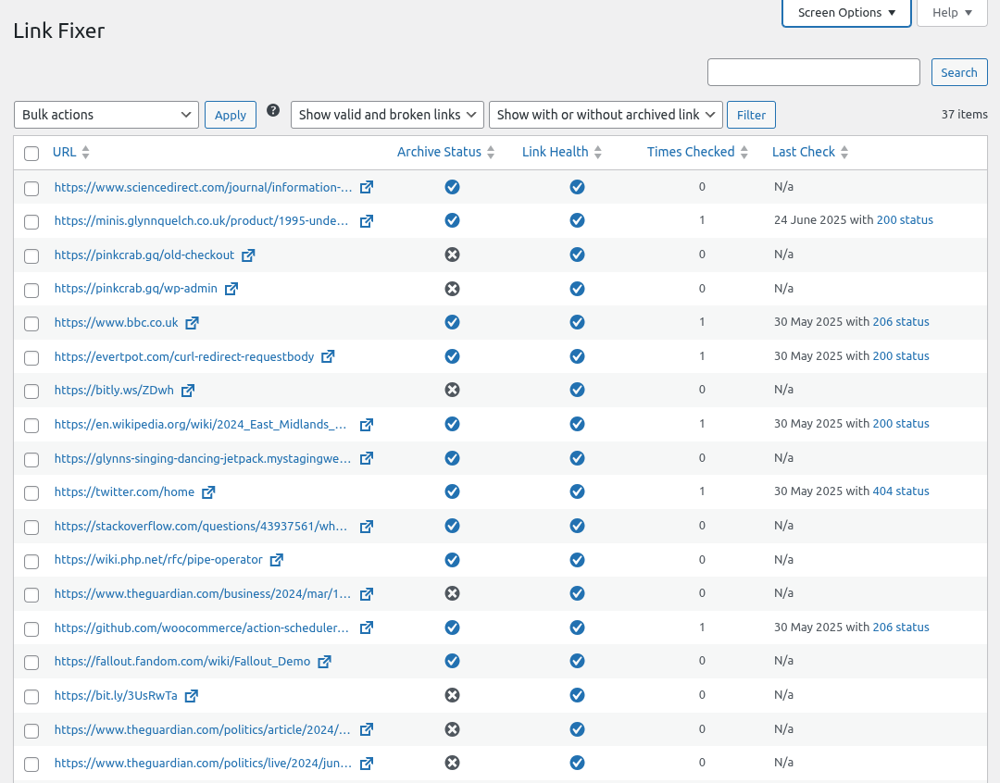

Here you can see the status of each link, the number of snapshots available, and the date of the last snapshot.

You can open the help context at any time for additional information.

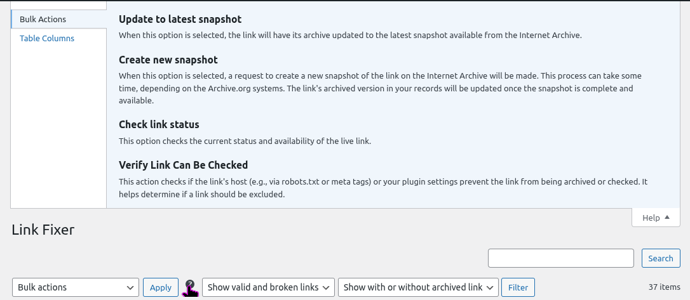


### URL

You can access the report for the link by clicking on the URL. This will take you to the link report page, which gives more information about the link and its status. You can also access the links target in a new tab by clicking the link icon next to the URL.

### Archive Status

| | |
|---|---|
|  | A checkmark indicates that we have a defined archived link for this URL. Clicking this will access the archived snapshot. |
|  | A cross indicates that we do not have an archived link for this URL. |
|  | A clock indicates that we are currently trying to create a new snapshot for this URL. |
|  | A plus indicates that this is a new link that has not started the process yet. This will happen ASAP |


### Link Health

| Icon | Meaning |
|---|---|
|  | A checkmark implies that the link was valid on the last check. |
|  | A cross indicates that the link is broken |
|  | A clock indicates that the link has not yet been checked. It might still be being processed. |


### Check Count

Denotes the number of the times we have checked if the link is still active.

### Last Check

Displays the date and time of the last check.

## Actions

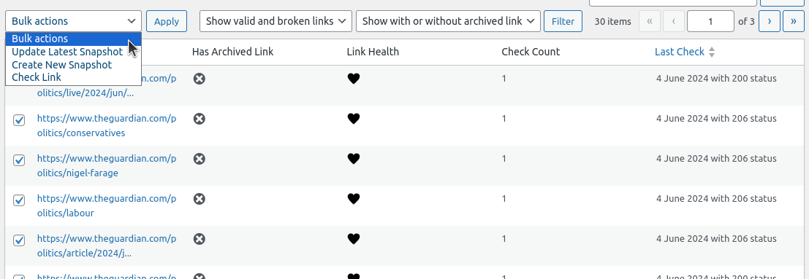

You can select which links you wish to apply the bulk actions to by checking the box next to the URL.

### Update To Latest Snapshot

This will update the link to the latest snapshot that exists on the Wayback Machine. *This will not create a new snapshot!*

### Create New Snapshot

This will setup an event using the action scheduler to create a new snapshot of the link. If a new snapshot can be created, the links archived link will be updated to the new snapshot.

### Check Link Status

This will trigger a check of the link to see if it is still active.

### Verify Link Allows Checking

This will verify if a link allows checking. If it does not, the link will be excluded from being checked.

> Please note some urls do not allow bots to check the status of the link, this will often result in links being reported as a 403 even if still active and result in false positives.

## Link Report

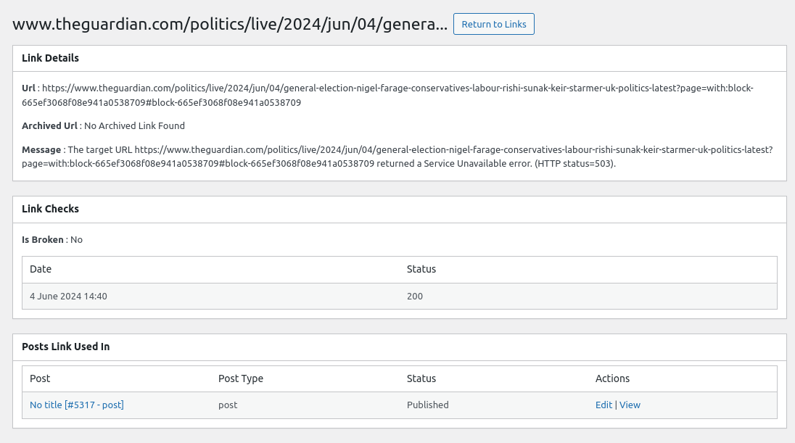

Each link has a details page which gives more information about the link.

### Link Details

#### URL 

The URL of the link.

#### Archived URL

The archived URL if one exists.

#### Message 

If there are any issues in creating or finding a snapshot, this will be displayed here.

### Link Checks

This lists all checks, with the date/time plus the resulting http status code. It will also show if the link is broken or not.

### Posts Link Used In

This list all posts which the link appears.

## Post/Page List Table

The number of links and how many are broken is shown on the post list table. 

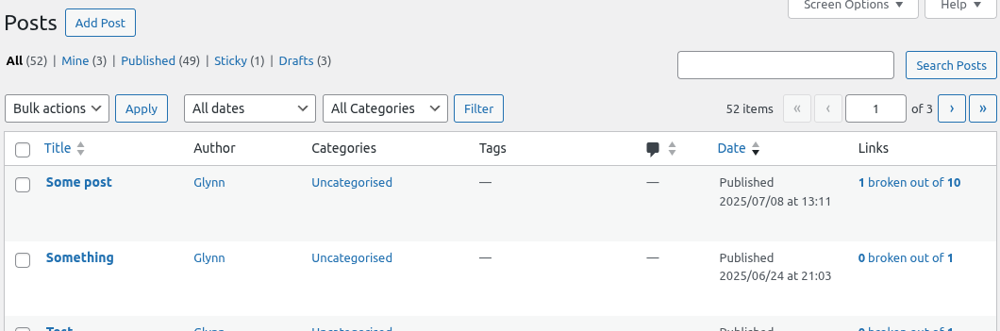

The link count is clickable, this will access a filtered link list for that post.

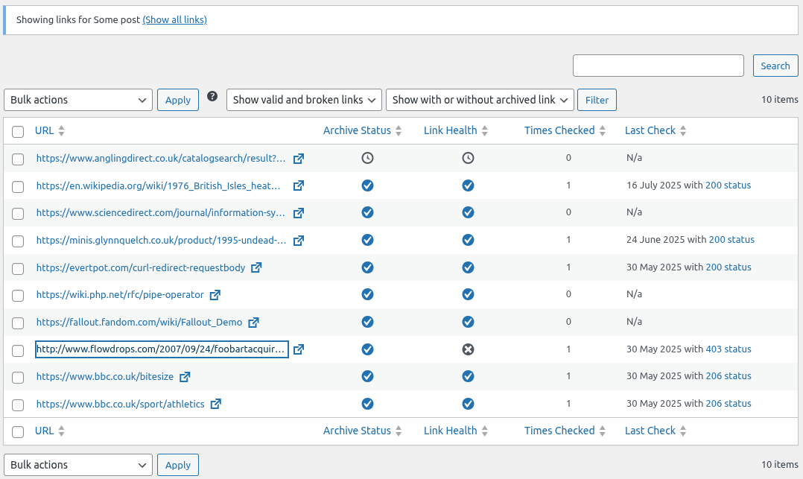

## Developer Documentation

### Dependencies

The plugin uses the following dependencies:
* Action Scheduler - This is added using the defined loader, so any later version will be used in its place gracefully.

### Process (Action Scheduler Events)

Almost all operations are carried out using the Action Scheduler, this allows for the plugin to be more performant and not cause issues with timeouts.

#### Find or Create Snapshot

When a new link is encountered in the content, we check if `Wayback Machine` has a snapshot of the link. If it does we store the snapshot URL. If it does not we attempt to create a new snapshot.

Action : `wlf_find_or_create_snapshot`

Args: [Link ID]

#### Create New Snapshot

If we need to create a new snapshot, we attempt to create one. If we are successful we get a snapshot event id from the "Wayback Machine" and store it.

> We attempt to do this 3 times, with a 15 minute pause between attempts. If we fail we store the error message.

Action: `wlf_create_new_snapshot`

Args: [Link ID, Attempt Number]

> The number of retires can be changed by using the [`wlf_create_new_snapshot_attempts`](#wlf_create_new_snapshot_attempts) filter.

#### Check Snapshot Status

Once we have a snapshot event id, we check the status of the snapshot. If it is successful we update the link with the new snapshot URL.

Action: `wlf_check_snapshot_status`

Args [Link ID, Wayback Event ID, Attempt Number]

> The number of retires can be changed by using the [`wlf_check_snapshot_status_attempts`](#wlf_check_snapshot_status_attempts) filter.

> The time between retries can be changed by using the [`wlf_check_snapshot_status_interval`](#wlf_check_snapshot_status_interval) filter. (Time in seconds)

#### Update Archive URL

Once a snapshot has been created, we attempt to update the link with the new snapshot URL. As it can sometimes take some time for the archives to appear this is checked with a delay between attempts.

Hook: `wlf_update_archive_url`

Args: [Link ID, Attempt Number]

> The number of retires can be changed by using the [`wlf_update_archive_url_attempts`](#wlf_update_archive_url_attempts) filter (3 by default)


#### Scan Existing Posts

When the plugin is activated, we check all existing posts for links. This is done using the `wlf_scan_existing_posts` action. Every 10 minutes we check if there are any posts which has not been scanned. If we find any, 10 will processed at 1 time.

> You can control how many posts are processed per batch using the [`wlf_posts_per_batch`](#wlf_posts_per_batch) filter (defaults to 10)

> You can control how often the scan is run using the [`wlf_scan_existing_posts_interval`](#wlf_scan_existing_posts_interval) filter (defaults to 10 minutes)

### Hooks

The plugin is designed to be extensible, with a number of hooks and filters available for developers to use.

#### `wlf_link_checker_timeout`

This is used to determine how long we should wait when checking if a link is still valid. The default is 5000ms (5 seconds).

```php
add_filter( 'wlf_link_checker_timeout', function( int $timeout ): int {
   return 10000; // 10 seconds
});
```

#### `wlf_link_exclusions`

This is used to add additional exclusions to the link checker. This is fired with the defined exclusions from settings.

```php
add_filter( 'wlf_link_exclusions', function( array $exclusions ): array {
   $exclusions[] = 'https://example.com/*';
   return $exclusions;
});
```

#### `wlf_posts_per_batch`

This is used to define how many posts should be checked, when the plugin is scanning existing posts.

```php
add_filter( 'wlf_posts_per_batch', function( int $posts_per_batch ): int {
   return 20;
});
```

##### `wlf_link_check_duration_in_days`

This is used to define how many days should be between checking if a link is still valid. The default is 7 days.

```php
add_filter( 'wlf_link_check_duration_in_days', function( int $days ): int {
   return 14; // 14 days
});
```

#### `wlf_valid_http_status_codes`

This return array is used to determine what http status codes are considered valid. The default is `200`, `206` and `429`.

```php
add_filter( 'wlf_valid_http_status_codes', function( array $codes ): array {
   $codes[] = 301;
   return $codes;
});
```

#### `wlf_failed_count`

This is used to define how many checks with non valid status codes are encountered before marking a link as broken. The default is 5.

```php
add_filter( 'wlf_failed_count', function( int $checks ): int {
   return 3;
});
```

#### `wlf_create_new_snapshot_attempts`

This is used to define how many times we should attempt to create a new snapshot. The default is 3.

```php
add_filter( 'wlf_create_new_snapshot_attempts', function( int $attempts ): int {
   return 5;
});
```
#### `wlf_check_snapshot_status_attempts`

This is used to define how many times we should attempt to check the status of a snapshot. The default is 3.

```php
add_filter( 'wlf_check_snapshot_status_attempts', function( int $attempts ): int {
   return 5;
});
```

#### `wlf_check_snapshot_status_interval`

This is used to define how long we should wait between checking the status of a snapshot. The default is 300 seconds (5 minutes).

```php
add_filter( 'wlf_check_snapshot_status_interval', function( int $interval ): int {
   return 10 * \MINUTE_IN_SECONDS; // 10 minutes
});
```

#### `wlf_update_archive_url_attempts`

This is used to define how many times we should attempt to update the archive URL. The default is 3.

```php
add_filter( 'wlf_update_archive_url_attempts', function( int $attempts ): int {
   return 5;
});
```

#### `wlf_scan_existing_posts_interval`

This is used to define how often we should check for posts which have not been scanned. The default is 10 minutes.

```php
add_filter( 'wlf_scan_existing_posts_interval', function( int $interval ): int {
   return 5 * \MINUTE_IN_SECONDS; // 5 minutes
});
```

#### `wlf_check_validator_status_interval`

This is used to define how often we should check if the validator is still running. The default is 2 minutes.

```php
add_filter( 'wlf_check_validator_status_interval', function( int $interval ): int {
	return 1 * \MINUTE_IN_SECONDS; // 1 minute
});
```

#### `wlf_check_validator_status_attempts`

This is used to define how many times we should attempt to check if the validator is still running. The default is 3.

```php
add_filter( 'wlf_check_validator_status_attempts', function( int $attempts ): int {
	return 5;
});
```


#### `wlf_is_valid_check`

This filter is used when a url is checked and we are returning if the link is valid or not. The default is to check if the status code is in the `wlf_valid_http_status_codes` array.

```php
add_filter( 'wlf_is_valid_check', function( bool $is_valid, array $check, Link $link ): bool {
   // If the link is from foo.com and the status code is 301 or 302, treate as valid
   if ( strpos( $link->get_href, 'foo.com' ) !== false && in_array( $check['status_code'], [ 301, 302 ] ) ) {
	  return true;
   }
});
```

> The `$check` array contains the following keys: `status_code (string)`, `date (Y-m-d H:i:s)`.
> For all public methods of the `Link` model, see the codebase (src/Link/Link.php)

#### `wlf_exclude_link_from_post`

This allows a link to be excluded from the list of links generated for a post. If a link is excluded, it will not be checked or have its link replaced when viewing the post.

```php
add_filter( 'wlf_exclude_link_from_post', function( bool $exclude, Link $link, int $post_id ): bool {
	if ( strpos( $link->get_href(), 'example.com' ) !== false ) {
	  return true;
	}
	return $exclude;
});
```

> Please note if a link is already being excluded, this is likely due to the site blocking any uptime checking bots and allowing these links to be checked will likely result in false positives.

#### `wlf_link_checker_url_params`

This is the array of parameters which are passed to the `wp_remote_get` function when checking if a link is still valid.

> Please note url=https://the-url-to-check.com should always passed.

```php
add_filter( 'wlf_link_checker_url_params', function( array $params ): array {
   $params['skip_cache'] = 10; // Skip the IA cache (5 mins by default)
   return $params; 
});
```

Additional args
* `impersonate=1`: use https://github.com/yifeikong/curl_cffi
to impersonate Chrome 110 and potentially avoid TLS fingerprinting blockers.
* `skip_adblocker=1`: The service uses an Adblocker by default https://pypi.org/project/braveblock/
* `skip_cache=1`: The service caches results for 5 minutes. Use this param to skip the cache.
* `kip_wbm_blocker=1`: The service blocks Wayback Machine URLs by default. Use this parameter to skip it
* `user_agent=<str>`: Use a custom `user-agent` HTTP header


#### `wlf_link_checker_url_base`

This is the base url of the link checker and doesnt really need changing unless you are running tests or your own custom endpoint for addtional caching.

```php
add_filter( 'wlf_link_checker_url_base', function( string $url ): string {
   return 'https://my-custom-link-checker.com';
});
```

#### `wlf_find_snapshot_base_url`

This is the url which is used when looking for a snapshot of a link. This should not need changing unless you are running tests or have your own custom endpoint.

```php
add_filter( 'wlf_find_snapshot_base_url', function( string $url ): string {
	   return 'https://my-custom-snapshot-finder.com';
});
```

> Please note these only apply when using the default `Link_Checker_Client` class.

#### `wlf_get_latest_snapshot_url`

This is the url which is called to get the latest snapshot of a link.

```php
add_filter( 'wlf_get_latest_snapshot_url', function( string $base_url, string $url ): string {
	return sprintf( '%s?url=%s', $base_url, urlencode( $url ) );
});
```

#### `wlf_get_closest_snapshot_url`

This is the url which is called to get the snapshot closest to a defined date.

```php
add_filter( 'wlf_get_closest_snapshot_url', function( string $base_url, string $url, DateTime $date ): string {
	return sprintf( '%s?url=%s&timestamp=%s', $base_url, urlencode( $url ), $date->getTimestamp() );
});
```

#### `wlf_archive_api_status_duration`

This set how long the wait should be between checking the status of the archive API. The default is 1 hour.

```php
add_filter( 'wlf_archive_api_status_duration', function( int $url ): int {
	return 30 * \MINUTE_IN_SECONDS; // 30 minutes
});
```

#### `wlf_add_own_content_to_wayback_machine`
This filter is applied to the setting which allows the user to add their own content to the Wayback Machine. The default is false and can be controlled via settings also.

```php
add_filter( 'wlf_add_own_content_to_wayback_machine', function( bool $add_own_content ): bool {
	return true;
});
```

> Please note when a post is added, a 10 minute delay is added before the post is added to the Wayback Machine. This will prevent the internet archive from blocking the request and creating lots of snapshots with no real changes.

#### `wlf_own_content_post_types`
This allows control over which post types are allowed to be added. The default is `post` and `page`.

```php
add_filter( 'wlf_own_content_post_types', function( array $post_types ): array {
	$post_types[] = 'custom_post_type';
	return $post_types;
});
```

#### `wlf_routinely_update_wayback_machine`
When this is set to retturn true, all posts in the allowed post types will be routinely updated in the Wayback Machine. The default is false.

```php
add_filter( 'wlf_routinely_update_wayback_machine', function( bool $routinely_update ): bool {
	return true;
});
```

#### `wlf_routinely_update_wayback_machine_interval`
This is used to denote how long between each routine update. The default is 14 days. `The time is give in seconds.`

```php
add_filter( 'wlf_routinely_update_wayback_machine_interval', function( int $interval ): int {
	return 7 * \DAY_IN_SECONDS; // 7 days
});
```

#### `wlf_own_content_allow_post`
This filter allows a final decision to be made on if a post should be added to the Wayback Machine. The default is to allow all posts.

```php
add_filter( 'wlf_own_content_allow_post', function( bool $allow, int $post_id ): bool {
	if ( get_post_meta( $post_id, 'do_not_archive', true ) ) {
		return false;
	}
	return $allow;
});
```

### Internet Archive / Wayback Link Fixer Instances.

Both the Link Checker and Snapshot clients are all extended from the following interfaces:  

* WPCOMSpecialProjects\Wayback_Link_Fixer\Wayback_Machine\Link_Checker_Client  
* WPCOMSpecialProjects\Wayback_Link_Fixer\Wayback_Machine\Snapshot_Client  

Both of these classes return documented arrays of data, so can be overridden to use a different service if needed.

To change which class is used, you can use the following filters:

#### Link Checker Client.

```php
class My_Custom_Link_Checker_Client implements Link_Checker_Client {
   ....
}

add_filter( 'wlf_link_checker_client', function( Link_Checker_Client $client ): Link_Checker_Client {
   return new My_Custom_Link_Checker_Client();
});
```

#### Snapshot Client.

```php
class My_Custom_Snapshot_Client implements Snapshot_Client {
   ....
}

add_filter( 'wlf_snapshot_client', function( Snapshot_Client $client ): Snapshot_Client {
   return new My_Custom_Snapshot_Client();
});
```
### Contribute

If you would like to contribute to the this plugin, feel free to do so. There are a number of tools which can be used to help in your development.

#### PHPCS\PHPCBF

This project is setup to use a customised version of the WordPress Extra ruleset. This is to ensure that the code is following the WordPress coding standards. To run the checks, you can use the following command:

```bash
composer lint:php # This will run the code through phpcs
composer format:php # This will run the code through phpcbf
```

#### PHPUnit

The plugin comes with a small set of unit tests, these must all pass before a PR can be merged. To run the tests, you can use the following command:

```bash
composer test:php
```

> You can run the full set of linting and tests with `composer run:php`, this will install dev dependencies and run the tests and then optimize the autoloader with a production ready version.
